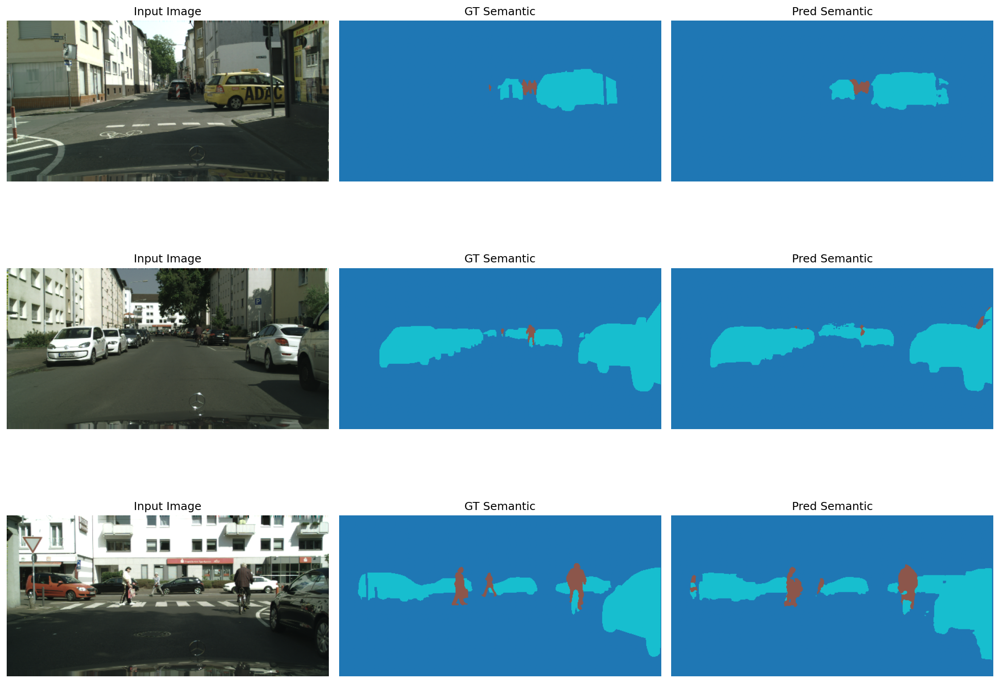
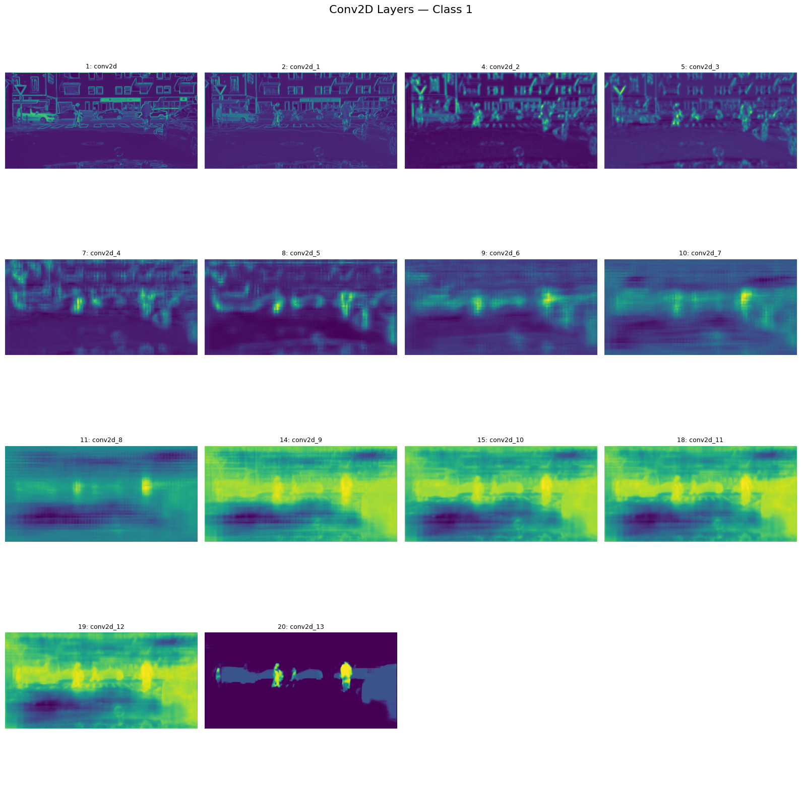

# Computer Vision - Project 3: Semantic Segmentation

**Authors:** Piotr Franc
**Date:** January 2026

---

## Overview

This project implements **Semantic Segmentation** on urban street scenes using the [Cityscapes dataset](https://www.cityscapes-dataset.com/). The goal is to classify each pixel into predefined categories: background, vehicle, and person.

---

## Dataset

- **Source:** [Cityscapes Dataset](https://www.cityscapes-dataset.com/)
- ~3,000 labeled training images, ~500 validation images
- Original resolution: 1024 × 2048 → downscaled to **256 × 512** to reduce memory and computation

### Data Augmentation

- Horizontal flipping
- Random brightness and contrast adjustments

---

## Project Scripts

| Script | Description |
|---|---|
| `utils/resizing_script.ipynb` | Resizes and organizes images from the original dataset |
| `empirical_Testing.ipynb` | Generates training plots and predictions from models |
| `show_explanations.ipynb` | Layer-wise interpretability: visualizes deep layer activations |
| `testing_architectures.ipynb` | Trains 3 architectures with custom logger and TensorBoard logging |
| `testing_loss_functions.ipynb` | Trains 1 model with 3 different loss functions and logs performance |
| `training_final_model.ipynb` | Trains the final chosen model for 30 epochs |
| `gradio_app.py` | Loads the best model and launches a Gradio GUI for interactive testing |

---

## Model Architectures

Three architectures were implemented and compared:

| Model | Description |
|---|---|
| **Model 1** | Standard U-Net with a **soft attention mechanism** |
| **Model 2** | Shallower but wider U-Net |
| **Model 3** | Deeper network using **dilated convolutions** in a semantic stack |

**Key finding:** Model 3 trained the fastest and achieved scores better than Model 2 and comparable to Model 1.

### Model 3 — Sample Predictions

---

## Metrics

- **Dice Coefficient**
- **Mean Intersection over Union (Mean IoU)**

Additional monitored metrics:
- Class IoU variance
- Learning rate schedule
- Mean class IoU

An **adaptive learning rate** (reduces on plateau) was used as the adaptive hyperparameter.

---

## Loss Function Experiments

Three loss functions were evaluated and compared:

1. **Sparse Categorical Cross Entropy** — slightly best overall performance
2. **Weighted Categorical Cross Entropy** — performed well
3. **Dice Loss** — underperformed compared to the others

> Sparse cross entropy slightly outperformed weighted cross entropy, possibly due to non-optimized class weighting.

---

## Interpretability: Layer-wise Explainability

A layer-wise interpretability analysis was applied to the trained U-Net. For a selected class, the method:

1. Computes class probability maps
2. Correlates them with feature maps from each Conv2D layer
3. Produces weighted, normalized activation heatmaps

This highlights which spatial features and layers contribute most strongly to the final prediction.

### Class: Vehicle

### Class: Person

